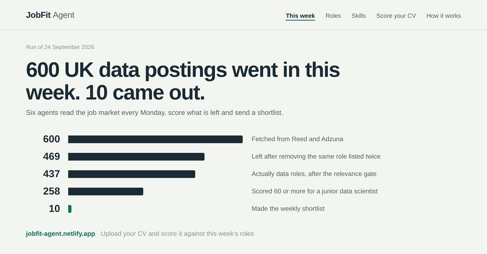

# JobFit Agent

Six agents read the UK data job market every week, score every posting against a CV, explain each
score, and email a shortlist with no human in the loop.

**Live site: [jobfit-agent.netlify.app](https://jobfit-agent.netlify.app)**

[](https://github.com/eo-datascience/JobFit-Agent/actions/workflows/ci.yml)
[](https://github.com/eo-datascience/JobFit-Agent/actions/workflows/weekly-digest.yml)

[](https://jobfit-agent.netlify.app)

## At a glance

| | |
|---|---|
| **What** | Six agents ingest live UK job postings, score each one against a CV, and email a weekly shortlist with no approval step |
| **Runs** | Every Monday on GitHub Actions. No server, no machine of mine involved |
| **Python** | Extraction, scoring, forecasting, digest, outcome learning. 281 tests |
| **Frontend** | React, TypeScript, Vite. 25 tests, including parity tests against the Python scorer |
| **Infrastructure** | GitHub Actions, Netlify, Netlify Functions, Resend, Prophet, pytest, Vitest, ruff |
| **Data** | Reed and Adzuna APIs, roughly 600 postings a week across three fields |

## Three things worth looking at

**Scoring exists twice and cannot drift.** A visitor's CV is scored in their own
browser so it never leaves their machine, which means the scoring maths exists in
Python and in TypeScript. Python writes fixtures from its own scorer, the frontend
tests assert the TypeScript reproduces them exactly, and CI regenerates the
fixtures and fails on any difference. See
[`scripts/make_parity_fixtures.py`](scripts/make_parity_fixtures.py) and
[`frontend/src/scoring.test.ts`](frontend/src/scoring.test.ts).

**Twelve bugs that only real data could find.** None appeared in the test suite.
Each now has a test. Three examples:

- The forecaster reported Kubernetes demand rising 155 percent. It was one posting a week. The guard against thin data was summing percentage shares instead of counting postings.
- One week every skill was falling, the next every skill was rising. Short excerpts were in the denominator, so as their share of a week changed, every skill moved with it.
- Roles the system knew nothing about outranked roles it had fully analysed, because dropping the unknown skills component spread its weight onto factors that are easy to score highly on.

The [full log](https://jobfit-agent.netlify.app/how-it-works#log) explains all twelve.

**Nothing is invented.** Skills are matched word for word against a curated
taxonomy, so a skill cannot be reported unless the posting contains it. Where a
language model is used at all, everything it returns is checked against the
source text before it is kept.

## Where the code lives

```
agents/          the six agents, plus the taxonomy, domains and skill families
  ingestion.py     Reed and Adzuna clients, deduplication
  extraction.py    skill matching, essential detection, relevance gate
  scoring.py       the weighted score and its explanation
  forecasting.py   weekly skill demand, and its refusals to guess
  digest.py        the weekly email
  outcomes.py      learning weights from real application results
  export.py        the public snapshot, built from public inputs only
frontend/        the React site, including the in browser scorer
.github/         weekly run, outcome recording, CI
tests/           281 tests
```

## How it works in detail

The reasoning behind each agent, including why two job sources are used, how
extraction avoids inventing skills, how the forecaster refuses to guess, and how
the digest acts safely with no approval step, is in
[docs/design-notes.md](docs/design-notes.md).

## Testing

```
pytest                                    # the Python agents
cd frontend && npm test                   # the browser scorer
python scripts/make_parity_fixtures.py    # regenerate the parity fixtures
```

## Setup

```bash
python -m venv .venv && source .venv/bin/activate
pip install -r requirements.txt
cp .env.example .env     # then fill in your keys
```

Keys are free and issue instantly from developer.adzuna.com and
reed.co.uk/developers/jobseeker.

## Running

```bash
python run_weekly.py --preview     # the whole scheduled job, sending nothing
python run_weekly.py --export-only # refresh the dashboard from live postings
python run_outcomes.py list        # roles the digest has sent
```

Each agent also runs on its own, for example `run_ingestion.py`,
`run_extraction.py`, `run_scoring.py`, `run_forecast.py` and `run_digest.py`.
Every one takes `--help`.

## Who built this

Emmanuel Olusolade, a data professional in London, currently completing an MSc
in Big Data and Data Science Technology. Solely authored, including the
architecture, the agents, the site and the deployment.

Open to junior data scientist and data engineer roles.
[LinkedIn](https://www.linkedin.com/in/emmanuel-olusolade-09a5a8347/) and
[GitHub](https://github.com/eo-datascience).

Released under the [MIT licence](LICENSE).
